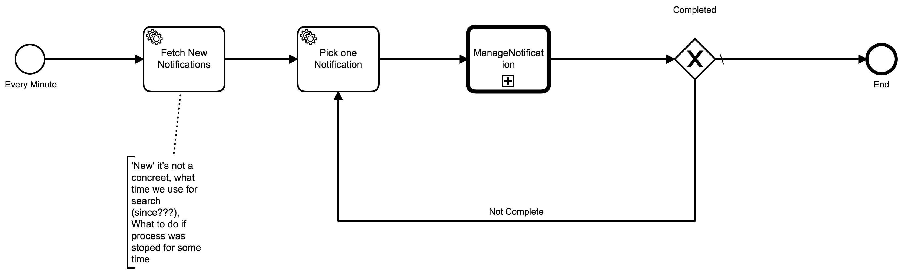
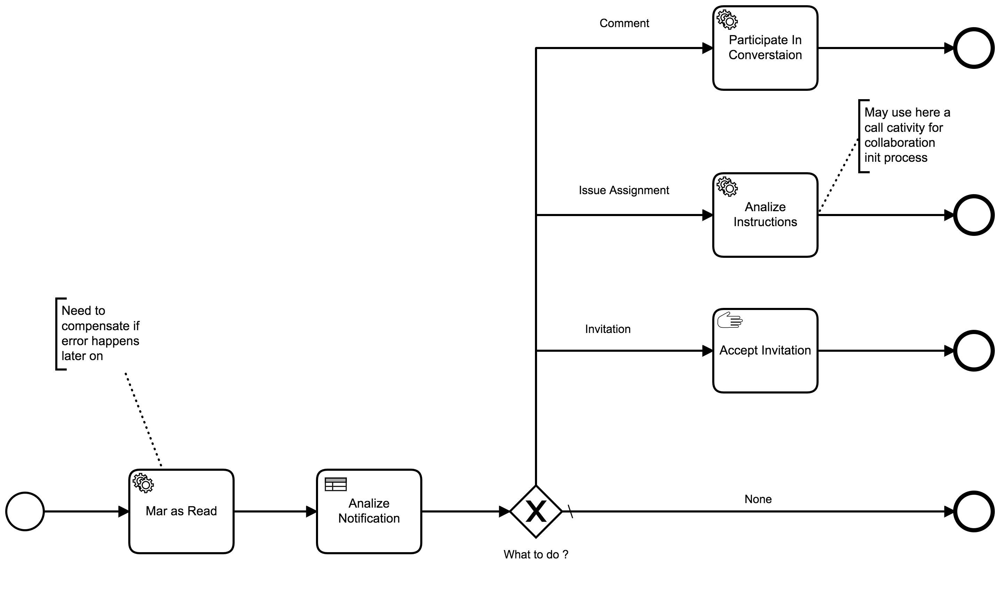

# Github Sync

Plays as a Gateway between all system and Github

Table of Contents
=================

* [Workflows](#workflows)
    * [Read New Notifications](#read-new-notifications)
    * [Manage Notifications](#manage-notifications)

## Workflows

### Read New Notifications

### Manage Notifications

